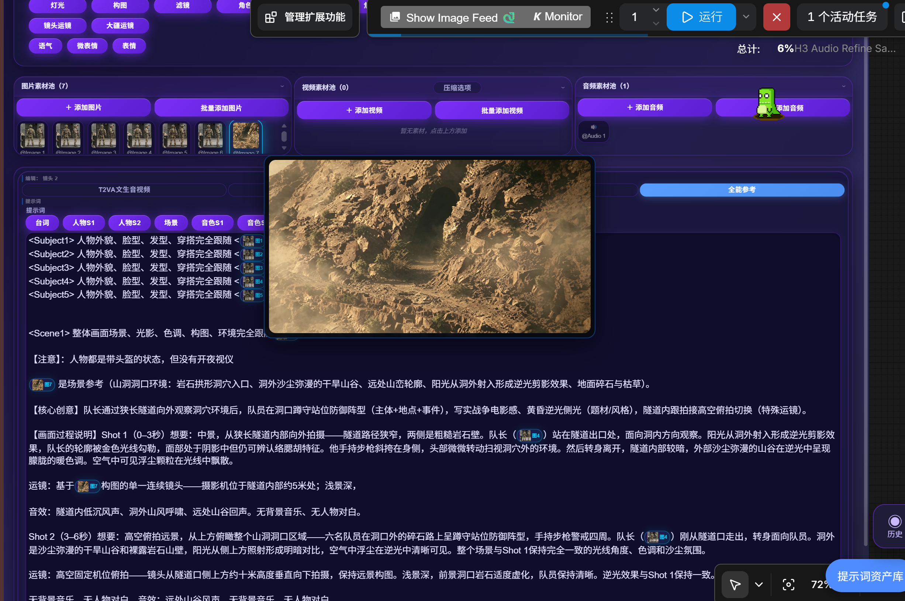

# CGS-导演台（CGS-Director）

基于 ComfyUI 原生 MiniMax H3 开源权重的多模态视频导演工作台。集成文生音视频、首尾帧约束、参考生成三种模式，提供中文统一面板、可视化分镜时间线、分层参考、运镜库、画质/风格预设、长视频末帧衔接、台词标签与模板按钮、微表情/语气/表情预设、素材悬停大图预览、操作历史记录与中文报错自检。

> 适用 ComfyUI 0.30.0+，本地开源权重（非 API）。所有参数均可在面板中修改，默认值采用官方推荐。

---

## 一、安装与位置

节点已放置在：

```
ComfyUI/custom_nodes/CGS-Director/
```

重启 ComfyUI 后，在节点列表中搜索「CGS-导演台」即可找到核心节点 **CGS-导演台·核心**。

---

## 二、核心节点参数详解

| 参数 | 说明 |
|------|------|
| model / clip / video_vae / audio_vae | 接入 H3 模型链路：UNETLoader（fl2va 或 ref2va 权重）→ CLIPLoader(type=minimax) → 视频VAE → 音频VAE |
| mode | 生成意图标签：T2VA文生音视频 / FL2VA首尾帧 / Ref2VA参考生成（实际路径由是否接入参考图自动决定） |
| prompt | 单镜头/全局提示词；使用分镜时间线时作为后备 |
| shots_json | 可视化时间线写入的分镜 JSON；留空则用上方单镜头参数 |
| resolution_preset | 分辨率预设（含 1080P/2K 横竖屏、方形等），自动对齐 32 像素网格 |
| width / height | 仅当分辨率预设选「自定义(使用下方宽高)」时生效 |
| duration | 单镜头时长（秒）；1–15 为训练范围，超出会警告 |
| camera_preset | 运镜预设，注入到提示词（推/拉/摇/移/环绕/跟随等 12 种） |
| style_preset | 风格预设，作为提示词前缀（电影感/写实/二次元/短剧/赛博朋克/水墨等） |
| quality_preset | 画质预设：标准 / 高画质 / 极速低显存（选「标准」不覆盖手动 steps/shift；选其他套用推荐值） |
| sampler_name / scheduler | 采样器与调度器，默认 res_multistep / native（官方模板） |
| steps / cfg / shift_video / shift_audio | 采样步数、CFG、视频/音频 flow shift，均可在面板修改 |
| seed | 随机种子（自动递增） |
| audio_mode | 生成（原生立体声）/ 静音（输出静音占位） |
| enable_long_video | 开启长视频：多镜头分段生成 |
| continuity | 断帧平滑衔接：把上一段末帧作为下一段首帧（仅无参考镜头生效） |
| auto_ref_tags | 自动在提示词末尾追加 `<Picture i>` 参考标签 |
| （无参考输入端口） | 参考素材不再走节点输入；改为前端**素材池**（图片/视频/音频上传），镜头勾选引用，见第四、五节 |

输出：`视频帧(IMAGE)`、`音频(AUDIO)`、`帧率(INT)`、`总帧数(INT)`、`运行报告(STRING)`。
直接连 `CreateVideo`（images+audio）再连 `SaveVideo` 即可成片。

---

## 三、快速上手



1. 菜单「工作流」→「打开」选择 `CGS-Director/examples/CGS-导演台-示例工作流.json`。
2. 在 UNETLoader / CLIPLoader / 两个 VAELoader 中选择你已下载的 H3 模型文件名（示例默认值见下文）。
3. 在 CGS-导演台·核心 的 prompt 输入文案，或点击节点上的「可视化时间线」增删镜头。
4. 点击「队列提示词」运行，输出视频保存在 `ComfyUI/output/video/CGS-导演台出品`。

示例工作流默认模型名（按你实际下载调整）：
- UNET：`minimax_h3_fl2va_pruned_int8_convrot.safetensors`
- CLIP：`qwen3vl_32b_minimax_h3_nvfp4_awq.safetensors`
- 视频VAE：`minimax_h3_video_vae_fp16.safetensors`
- 音频VAE：`minimax_h3_audio_vae_fp32.safetensors`

模型需从 HuggingFace `Comfy-Org/MiniMax-H3` 下载并放入对应 `ComfyUI/models/...` 目录。

---

## 四、可视化分镜时间线

核心节点上挂载了时间线组件，顶部可切换「时间轴 / 列表」两种视图，二者共用同一份分镜与素材数据：

**素材池（图片 / 视频 / 音频）**
- 点击「＋ 添加」从本地选择文件，上传到 ComfyUI 的 `input` 目录；图片显示缩略图，视频/音频显示类型图标。
- 每个素材获得一个全局索引（卡片左上角数字），镜头通过索引引用它。
- 删除素材时，下方所有镜头的引用索引会自动修正，不会错位。

**分镜轨道**（镜头横向排列，可横向滚动）
- 「＋ 新增镜头」添加镜头（克隆上一镜头设置，种子 +1）；卡片可编辑 名称 / 启用 / 模式 / 提示词 / 负面提示 / 运镜 / 自定义运动 / 风格 / 时长 / 种子 / 字幕。
- 在「素材引用」区勾选本镜头要用的 图片/视频/音频 素材（即 `<Picture i>` / `<Video k>` / `<Audio j>`）。
- 用卡片上的「↑ ↓」或**直接拖拽卡片**调整镜头顺序（顺序即成片顺序）。
- 所有改动实时写入 `shots_json`（含 `materials` 与 `shots`），随工作流一起保存。

> 若前端未加载该组件，可在 `shots_json` 文本框直接粘贴等效 JSON：
> `{"materials":{"images":["a.png"],"videos":[],"audios":[]},"shots":[{"id":"shot_0","name":"镜头1","prompt":"...","ref_image_idx":[0]}]}`
> 空值与默认字段在保存时会自动省略；「新增镜头」克隆上一镜头（种子 +1）；禁用镜头显式保留 `enable:false`。

---

## 五、分层参考（角色锁定 / 风格复刻）

1. 在「素材池」上传参考图片/视频/音频；素材按上传顺序获得全局索引（0,1,2…）。
2. 在对应镜头的「素材引用」区勾选要用的素材；后端据此构建 `ref_images` / `ref_videos` / `ref_audios` 并自动编号：
   - 图片 → `<Picture 1>`、`<Picture 2>`……（最多 9 张）
   - 视频 → `<Video 1>`、`<Video 2>`……（最多 3 段）
   - 音频 → `<Audio 1>`、`<Audio 2>`……（最多 3 段）
   未勾选的素材不纳入该镜头。
3. 在提示词里用标签引用，例如：
   `一位少女站在街头，外貌参考 <Picture 1>，背景参考 <Picture 2>`
4. 勾选「auto_ref_tags」可自动追加全部引用标签；运行报告的「参考[图N/视频N/音频N]」会显示映射。图片参考可用 `image_ref_strength`（如 `[1,0.8]`）设置强度，强度≤0 的图不纳入该镜头。

> 务实说明：MiniMax H3 的 Ref2VA 无「逐参考权重滑块」。`image_ref_strength` 仅用于筛选(≤0排除)与提示词强调，并非原生逐像素权重；视频参考当前不附带独立音轨配对（ref_video_audios 未启用）。

---

## 六、预设库

- **画质预设**：标准（steps 25）、高画质（steps 40）、极速/低显存（steps 8，配合 int8 量化权重可显著降低显存）。
- **风格预设**：默认 / 电影感 / 写实 / 二次元 / 短剧 / 短视频 / 赛博朋克 / 水墨风，作为提示词前缀一键切换。
- **运镜预设**：推 / 拉 / 摇 / 移 / 升 / 降 / 缩放 / 环绕 / 跟随 / 手持 / 航拍，自动写入提示词。
- 所有预设均为「推荐起点」，面板中任意参数都可手动覆盖。

---

## 七、长视频与衔接

- 开启 `enable_long_video` 后，多个分镜镜头会被顺序生成并自动拼接成片。
- 开启 `continuity` 后，上一个镜头的**最后一帧**会作为下一个无参考镜头的首帧（FL2VA 续接），消除镜头接缝。
- 带参考图（Ref2VA）的镜头不支持首帧衔接（H3 原生限制：参考与关键帧不可同时用），靠参考图一致性保持人物/风格连续。

---

## 八、务实映射与已知限制

本节点严格基于 MiniMax H3 真实能力，以下为与「全能」设想的务实差异（均已按官方能力映射，非缺陷）：

1. **帧率固定 24fps**：H3 原生 24fps，面板不提供 30/60 选项（避免无效参数）。
2. **单段最长约 15 秒**：更长靠分镜分段 + 末帧衔接实现，已支持。
3. **无独立三层音轨**：音频由 H3 原生一次性生成（对白/音效/音乐混在立体声里）。如需音色锁定，用「音频参考」接入参考音频（Ref2VA 的音频参考）。
4. **参考无真正权重滑块**：`image_ref_strength` 用于筛选(≤0排除)与提示词强调，并非原生逐像素权重；参考控制由数量 + 索引引用 + 提示词描述共同决定。
6. **素材池上传到 input 目录**：图片/视频/音频通过前端上传到 ComfyUI 的 `input` 文件夹，文件名即引用名；删除素材请在前端素材池删除（仅移除引用关系，不会删除服务器上的文件）。
7. **视频/音频参考上限**：视频最多 3 段、音频最多 3 段；视频参考当前不含配对音轨，仅作画面参考。
5. **Ref2VA 不支持首帧衔接**：见第七节。

---

## 九、报错解决方案（中文自检）

| 报错信息 | 原因与解决 |
|----------|------------|
| 未连接模型(model) | 把 UNETLoader 输出连到核心节点 model 输入 |
| 未连接 CLIP | 连 CLIPLoader(type=minimax) 到 clip |
| 未连接视频 VAE / 音频 VAE | 连对应 VAELoader；音频模式为「生成」或用了参考图时必须连音频VAE |
| 接入了参考图但缺少音频 VAE | Ref2VA 需要音频 VAE，请连接 minimax_h3_audio_vae |
| 分镜 JSON 解析失败 | 检查 shots_json 是否为合法 JSON；建议用时间线组件编辑 |
| 镜头N 参考图超过9张上限 | H3 最多 9 张参考图，精简或拆分镜头 |
| 镜头N 时长超出训练范围 | 单段建议 ≤15s；超出质量可能下降，属警告非错误 |

---

## 十、文件结构

```
CGS-Director/
├── __init__.py                # 节点注册
├── cgs_presets.py             # 分辨率/运镜/风格/画质预设
├── cgs_director_core.py       # 核心节点（生成/分镜/参考/衔接/报错）
├── cgs_history.py             # 操作历史记录存储/缩略图/删除接口
├── cgs_seamless_compose.py    # 衔接模式合成（片段裁剪/拼接/音轨处理）
├── web/cgs_timeline.js        # 可视化分镜时间线前端（含模板/预设/悬停预览）
├── web/cgs_history.js         # 历史记录前端
├── examples/
│   ├── build_example_workflow.py  # 生成示例工作流（可改模型名）
│   └── CGS-导演台-示例工作流.json # 开箱即用工作流
└── README.md
```

---

## 十一、捐赠支持

如果 CGS-导演台 对你有帮助，欢迎扫码支持作者，你的支持是持续更新的动力！


